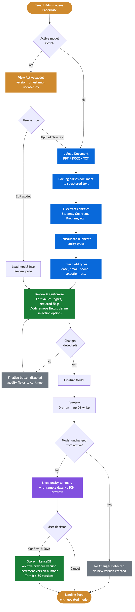
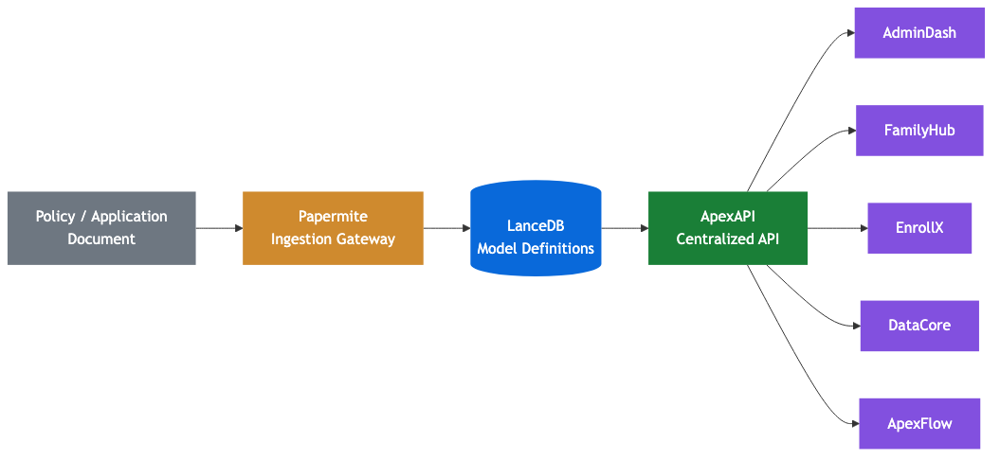

# Papermite

Papermite is the data ingestion gateway for the [NeoApex](https://github.com/NeoApex) platform. It transforms afterschool program documents (policies, application templates, handbooks) into structured, tenant-scoped data models using AI-powered extraction.

## What It Does

1. **Upload** a document (PDF, DOCX, or TXT) containing your program's policies or application forms
2. **AI extracts** structured entities — students, guardians, programs, enrollments, emergency contacts, and more
3. **Review and customize** the extracted model: edit fields, change data types, toggle required flags, define selection options
4. **Finalize** the model definition, which is versioned and stored for use by downstream NeoApex services

Papermite produces **model definitions** (schema only — field names, types, and constraints), not individual data records. These definitions drive dynamic forms and views across the NeoApex platform.

## User Flow



### NeoApex Integration



## Getting Started

### Prerequisites

- Python 3.11+
- Node.js 18+
- An API key for one of the supported LLMs (Claude, GPT, or Ollama for local use)

### Installation

```bash
# Clone the repository
git clone <repo-url>
cd papermite

# Backend
python -m venv .venv
source .venv/bin/activate
pip install -e ".[dev]"

# Frontend
cd frontend
npm install
cd ..
```

### Configuration

Users are authenticated via the DataCore global registry table (bcrypt-hashed passwords). No local `test_user.json` is needed — seed users are loaded into the registry during tenant onboarding.

Set your LLM API key as an environment variable:

```bash
export ANTHROPIC_API_KEY=sk-...    # For Claude models
# or
export OPENAI_API_KEY=sk-...       # For GPT models
```

### Running

Start both servers:

```bash
# Terminal 1 — Backend (port 8000)
cd backend
source ../.venv/bin/activate
uvicorn app.main:app --reload --port 8000

# Terminal 2 — Frontend (port 5173)
cd frontend
npm run dev
```

Open http://localhost:5173 in your browser.

## How to Use

### First-Time Setup

1. Open the app — you'll see the **Model Setup** page indicating no model exists yet
2. Click **Upload Document** and select your program's policy or application template
3. Choose an AI model from the dropdown (Claude Haiku is the default)
4. Click **Extract Entities** — the AI will parse the document and identify structured data

### Reviewing the Extraction

After extraction, you'll see entity cards (Student, Guardian, Program, etc.) with their fields:

- **Edit values** — click any field value to modify it
- **Change data types** — use the dropdown to set the appropriate type (str, number, bool, date, datetime, email, phone, or selection)
- **Selection options** — for selection-type fields, click the "opts" button to add/remove allowed values and toggle multi-select
- **Toggle required** — use the switch to mark fields as required or optional
- **Add custom fields** — click "+ Add custom field" at the bottom of any entity card
- **Remove fields** — custom fields can be deleted with the X button

### Finalizing the Model

1. Click **Finalize Model** to proceed to the confirmation page
2. Review the entity summary tables and JSON preview
3. Click **Confirm & Save** to store the model, or **Cancel** to discard
4. If no changes were detected from the previous version, the app will let you know and skip creating a new version

### Editing an Existing Model

From the landing page with an active model:

- **Edit Model** — opens the current model for manual field editing. The Finalize button stays disabled until you make a change.
- **Upload New Document** — re-extracts from a new document. The previous version is archived.

Each save creates a new version (up to 50 versions retained per tenant).

## Field Types

| Type | Description | Auto-detected from |
|------|-------------|-------------------|
| `str` | Free-form text | Default for most fields |
| `number` | Integer or decimal | Fields like `age`, `*_fee`, `*_count` |
| `bool` | True / false | Fields starting with `is_`, `has_`, `requires_` |
| `date` | Calendar date | Fields like `dob`, `*_date` |
| `datetime` | Date + time | Fields ending with `_at` |
| `email` | Email address | Fields containing `email` |
| `phone` | Phone number | Fields containing `phone` |
| `selection` | Predefined options | List or dict values from extraction |

## Tech Stack

- **Backend**: FastAPI, Pydantic, pydantic-ai, Docling (document parsing), LanceDB (vector storage)
- **Frontend**: React 19, TypeScript, Vite, react-router-dom, idb (IndexedDB)
- **AI Models**: Claude Haiku/Sonnet, GPT-4.1/5, Ollama (local)

## Project Structure

```
papermite/
├── backend/
│   └── app/
│       ├── main.py              # FastAPI app entry point
│       ├── config.py            # Settings and env config
│       ├── api/                 # Route handlers
│       ├── models/              # Pydantic domain + extraction models
│       ├── services/            # Parser, extractor, mapper
│       └── storage/             # LanceDB operations
├── frontend/
│   └── src/
│       ├── api/                 # API client functions
│       ├── components/          # EntityCard, FieldRow, etc.
│       ├── db/                  # IndexedDB draft storage
│       ├── pages/               # Landing, Upload, Review, Finalize
│       └── types/               # TypeScript interfaces
├── CLAUDE.md                    # AI assistant instructions
└── pyproject.toml               # Python package config
```

## Part of NeoApex

Papermite is one component of the NeoApex platform. It writes model definitions to LanceDB, which are read by **apexapi** and consumed by downstream services (admindash, familyhub, enrollx, datacore, apexflow) to dynamically construct entity views and forms.
